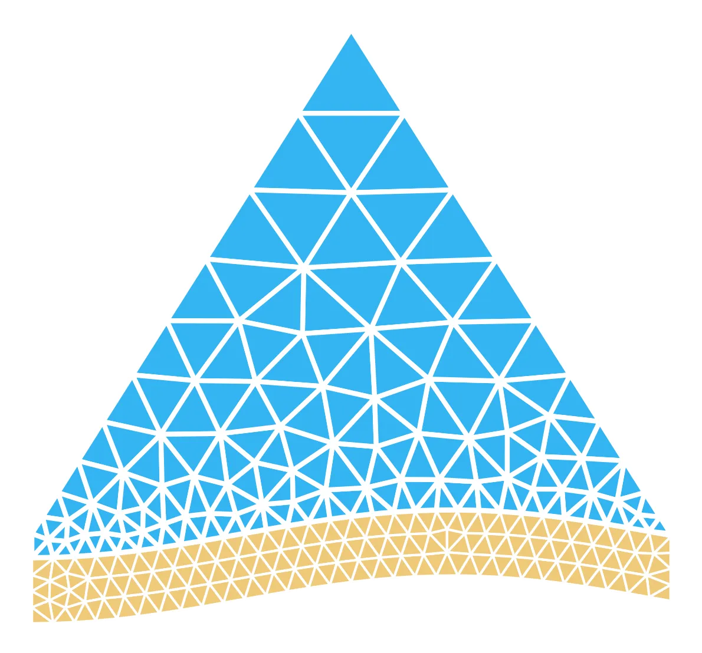

<p align="center">
  
</p>

## `BlueMesh2D: Delaunay-based mesh generation in Python`

`BlueMesh2D` is a `Python`-based unstructured mesh-generator for two-dimensional polygonal geometries, providing a range of relatively simple, yet effective two-dimensional meshing algorithms. `BlueMesh2D` includes variations on the "classical" Delaunay refinement technique, a new "Frontal"-Delaunay refinement scheme, a non-linear mesh optimisation method, and auxiliary mesh and geometry pre- and post-processing facilities. 

### This code is a translation of <a href="https://github.com/dengwirda/mesh2d">`MESH2D`</a>, a `MATLAB` / `OCTAVE`-based tool developed by Darren Engwirda.

Algorithms implemented in `BlueMesh2D` are "probably-good" - ensuring convergence, geometrical and topological correctness, and providing guarantees on algorithm termination and worst-case element quality bounds. Support for user-defined "mesh-spacing" functions and "multi-part" geometry definitions is also provided, allowing `BlueMesh2D` to handle a wide range of complex domain types and user-defined constraints. `BlueMesh2D` typically generates very high-quality output, appropriate for a variety of finite-volume/element type applications.

`BlueMesh2D` is a simplified version of my <a href="https://github.com/dengwirda/jigsaw-matlab/">`JIGSAW`</a> mesh-generation algorithm (a `C++` code). `BlueMesh2D` aims to provide a straightforward `Python` implementation of these Delaunay-based triangulation and mesh optimisation techniques. 

### `Code Structure`

`BlueMesh2D` is a pure `Python` package, consisting of a core library + associated utilities:

    BlueMesh2D::
    ├── bluemesh2d              -- core BlueMesh2D library functions. See refine, smooth, tridemo etc.
    ├── bluemesh2d/aabb_tree    -- support for fast spatial indexing, via tree-based data-structures.
    ├── bluemesh2d/geom_util    -- geometry processing, repair, etc.
    ├── bluemesh2d/geomesh_util -- mesh management, export, interpolation, etc.
    ├── bluemesh2d/hfun_util    -- mesh-spacing definitions, limiters, etc.
    ├── bluemesh2d/hjac_util    -- solver for Hamilton-Jacobi eqn's.
    ├── bluemesh2d/mesh_ball    -- circumscribing balls, orthogonal balls etc.
    ├── bluemesh2d/mesh_cost    -- mesh cost/quality functions, etc.
    ├── bluemesh2d/mesh_file    -- mesh i/o via ASCII serialisation.
    ├── bluemesh2d/mesh_util    -- meshing/triangulation utility functions.
    ├── bluemesh2d/ortho_merge  -- mesh orthogonalisation & merging (Delft3D-FM).
    ├── bluemesh2d/poly_data    -- polygon definitions for demo problems, etc.
    └── bluemesh2d/poly_test    -- fast inclusion test for polygons.


### `Quickstart`

### Installation

You can install **`bluemesh2d`** directly from PyPI:

```bash
pip install bluemesh2d
```

If you want to install it in *developer mode* (for local development and contribution):

```bash
pip install -e .
```

### Examples

    python -m bluemesh2d.tridemo  0; % a very simple example to get everything started.
    python -m bluemesh2d.tridemo  1; % investigate the impact of the "radius-edge" threshold.
    python -m bluemesh2d.tridemo  2; % Frontal-Delaunay vs. Delaunay-refinement refinement.
    python -m bluemesh2d.tridemo  3; % explore impact of user-defined mesh-size constraints.
    python -m bluemesh2d.tridemo  4; % explore impact of "hill-climbing" mesh optimisations.
    python -m bluemesh2d.tridemo  5; % assemble triangulations for "multi-part" geometries.
    python -m bluemesh2d.tridemo  6; % assemble triangulations with "internal" constraints.
    python -m bluemesh2d.tridemo  7; % investigate the use of "quadtree"-type refinement.
    python -m bluemesh2d.tridemo  8; % explore use of custom, user-defined mesh-size functions.
    python -m bluemesh2d.tridemo  9; % larger-scale problem, mesh refinement + optimisation. 
    python -m bluemesh2d.tridemo 10; % medium-scale problem, mesh refinement + optimisation. 

More examples available in [`BlueMath`](https://github.com/GeoOcean/BlueMath/tree/main/toolkit/mesh).

### `References`

If you make use of `BlueMesh2D` please include a reference to the following! `BlueMesh2D` is a translation of `MESH2D`, designed to provide a simple and easy-to-understand implementation of Delaunay-based mesh-generation techniques. For a much more advanced and fully three-dimensional mesh-generation library, see the <a href="https://github.com/dengwirda/jigsaw-matlab/">`JIGSAW`</a> package. `MESH2D` makes use of the <a href="https://github.com/dengwirda/aabb-tree">`AABBTREE`</a> and <a href="https://github.com/dengwirda/find-tria">`FINDTRIA`</a> packages to compute efficient spatial queries and intersection tests.

`[1]` - Darren Engwirda, <a href="http://hdl.handle.net/2123/13148">Locally-optimal Delaunay-refinement and optimisation-based mesh generation</a>, Ph.D. Thesis, School of Mathematics and Statistics, The University of Sydney, September 2014.

`[2]` - Darren Engwirda, Unstructured mesh methods for the Navier-Stokes equations, Honours Thesis, School of Aerospace, Mechanical and Mechatronic Engineering, The University of Sydney, November 2005.
