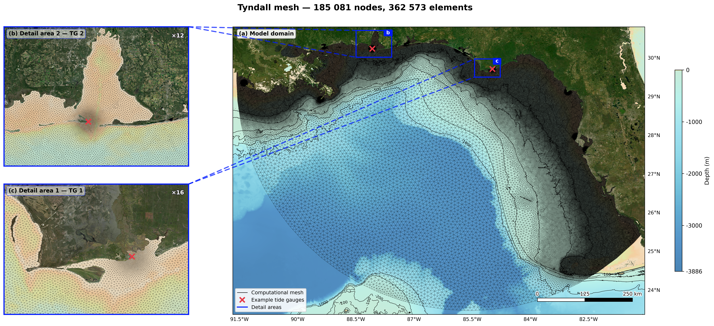
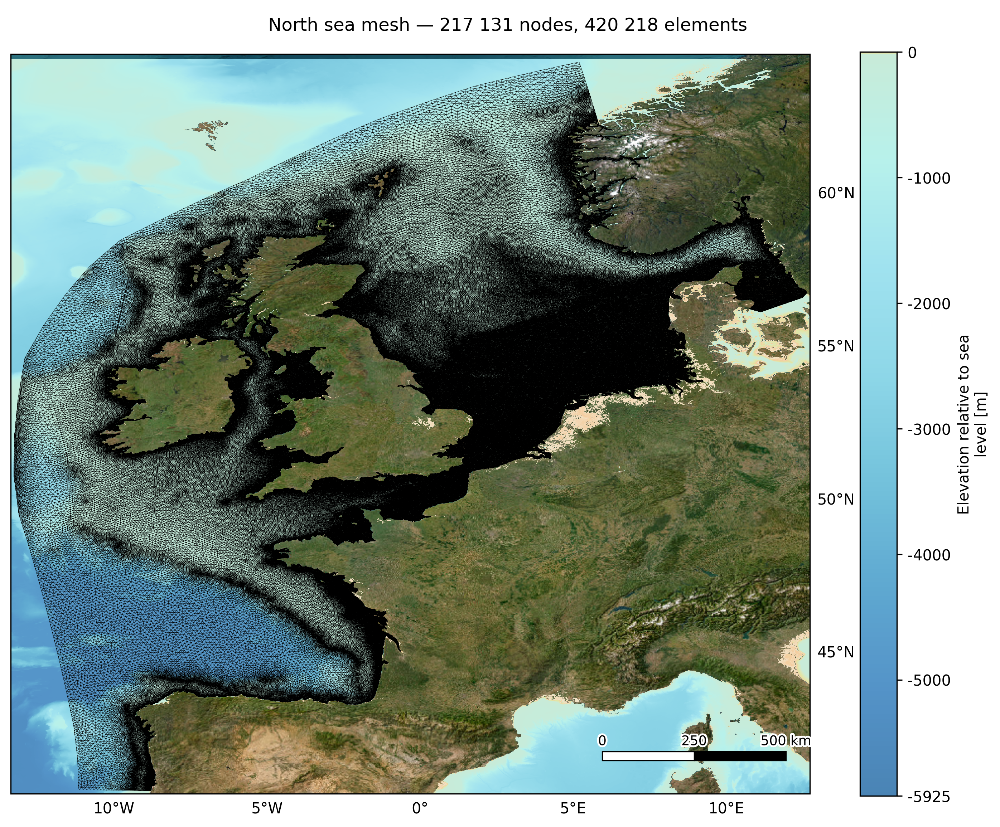

# Summary

Coastal numerical models require high-quality unstructured meshes, where element size must grade smoothly from metres nearshore to kilometres offshore. BlueMesh2D is an open-source, pure-Python mesh generator driven through a graphical QGIS interface (distributed as a Processing plugin) that produces simulation-ready unstructured meshes directly from a bathymetry raster, without scripting. It combines Delaunay and Frontal-Delaunay refinement [@Engwirda2014] with DistMesh-style optimization [@Persson2004], a Delft3D-FM orthogonalization pass, and a Lipschitz-limited size function [@Persson2006]. BlueMesh2D contributes an integrated coastal meshing workflow combining existing meshing algorithms with GIS-native editing, coastal-specific sizing functions, boundary classification and direct export to operational hydrodynamic models.

# Statement of Need

While coastal mesh generatos are available, each comes with its own set of trade-offs. OceanMesh2D [@Roberts2019] is one of the most established: resolution is driven by geometric and topo-bathymetric size functions, vertices are placed by a force-balance algorithm, and worst-case triangle quality is improved topologically. It runs in MATLAB, however, which restricts its reach. Several open Python descendants lift that restriction, among them oceanmesh [@Roberts2020], OCSMesh [@Mani2021], SeismicMesh [@Roberts2021] and seamsh [@Lambrechts2021], but they remain libraries: the domain, the sizing law and the export step are assembled in a script. Most are also thin layers over a general-purpose kernel, with OCSMesh delegating the meshing itself to JIGSAW [@Engwirda2014] and seamsh wrapping Gmsh [@Geuzaine2009], alongside Triangle [@Shewchuk1996] in other toolchains. These kernels are fast and well tested, but they are compiled C/C++ libraries, which is a real constraint inside a GIS, where the plugin must install into an existing Python environment that the user does not control. Commercial packages and solver-specific grid editors do offer a graphical interface, but at the cost of licensing and portability. QGIS, meanwhile, already holds the bathymetry, the coastline and the CRS (Coordinate Reference System) definitions, yet it cannot generate a mesh from them, so data are prepared in a GIS, exported, meshed elsewhere and re-imported for inspection. BlueMesh2D closes that loop by enabling users to generate highly complex coastal meshes directly within QGIS—providing a streamlined, no-code workflow in a fully open-source environment.

# Implementation

The meshing kernel is a Python translation and extension of the MESH2D/JIGSAW methodology [@Engwirda2014]. From a boundary (PSLG) and a size function h(x, y) it builds a constrained Delaunay triangulation. Triangle [@Shewchuk1996] is used opportunistically where the environment already provides it, but the kernel does not depend on it: a conforming-Delaunay construction in SciPy serves as a fallback, so no compilation step is required at install time. The triangulation is then refined either by classical Delaunay refinement or by the locally optimal Frontal-Delaunay scheme, both of which guarantee termination and bound worst-case element quality. A DistMesh-style hill-climbing optimisation [@Persson2004] relaxes vertex positions and applies local topological operations under a monotone quality criterion. For finite-volume flexible-mesh solvers, an optional orthogonalisation pass ported from Deltares MeshKernel bounds the edge-to-dual (flow-link) angle and removes short flow links, enforcing the near-orthogonality that D-Flow FM requires [@Kernkamp2011].

Element size can follow a depth polynomial, a wavelength law L(T, d)/N [@Hunt1979], bathymetric slope, a constant, or a user expression. Here L is the local linear wavelength, T the wave period chosen as reference, d the local water depth taken from the bathymetry, and N the number of elements requested per wavelength, so that shallower water yields shorter waves and therefore smaller elements. Each rule is floored, capped and gradient-limited by a Lipschitz smoothing pass [@Persson2006] so that size grades smoothly across the domain. Bathymetry is sampled at true raster cell centres, honouring the GeoTIFF pixel-is-area / pixel-is-point convention so that the extracted coastline and node depths register correctly against the source grid. Vertices flagged as fixed are preserved exactly throughout refinement and smoothing.

The meshing kernel is covered by an automated pytest suite: regression tests compare refinement and smoothing output against stored reference meshes, geometric-validity tests assert finite coordinates and non-degenerate triangles, and dedicated tests check that orthogonalization improves flow-link orthogonality while holding fixed vertices in place. Each pipeline stage is also exercised end-to-end on synthetic and real bathymetry, across the three major platforms and multiple QGIS releases.

On first load the plugin detects and installs missing dependencies into the running QGIS interpreter (via a plugin-managed virtual environment on externally managed system Pythons), so no manual setup is required on Linux, Windows or macOS.

# Functionality

BlueMesh2D exposes the kernel as six QGIS Processing algorithms that chain through editable layers:

- Domain extraction: contours the raster to a coastline and a clip domain (a user extent polygon or the buffered raster extent), intersects them in a local metric (UTM) CRS, repairs invalid geometry, and flags domain-boundary and coastline-intersection vertices as fixed. An auxiliary tool sets the fixed/free flag for every vertex inside an area drawn on the map or selected from a polygon layer, optionally editing the polygon in place so large groups of vertices can be pinned or released in one operation. → editable water polygon.
- Element-size function: evaluates the chosen sizing law with optional local "detail" refinement and gradient limiting. → size raster.
- Boundary resampling: re-parameterizes each ring at arc-length spacing weighted by 1/h, resampling arc-by-arc between fixed points so they survive exactly, and prunes spikes. → editable boundary-edge layer.
- Triangulation and optimization: constrained Delaunay refinement, smoothing, optional orthogonalization, and bathymetry sampling onto nodes. → UGRID mesh layer.
- Boundary-condition classification: traces boundary loops and classifies each segment as open/closed/island by depth. → editable btype line layer.
- Export: writes UGRID NetCDF (with optional metadata override), Delft3D-FM open-boundary files (`.pli`/`.bc`), or ADCIRC `.grd`, snapping boundary vertices back to mesh nodes so edits are honoured.

At each stage the user may edit the output before continuing (reshape the domain, change sizing parameters, move/add/delete boundary vertices, pin extra interior points, or reclassify boundary segments) and the next stage rebuilds from whatever remains. This human-in-the-loop, layer-based design is the tool's central usability contribution and its main point of difference from script-driven coastal meshers.

# Examples

As a representative application, we mesh the Bay of Santander (northern Spain) from EMODnet data [@EMODnet2022]: the terrestrial cells define the coastline and the marine cells supply the depth on a grid of 1/16 × 1/16 arc minute of longitude and latitude (ca. 115 × 115 m).

The water polygon is extracted at the coastline level, cut by a buffered circular extent, with cut and coastline-junction vertices flagged as fixed and user-defined fixed points pinning features of interest inside the estuary. A depth-based size function grades from roughly 20 m in the inner harbour to about 960 m offshore; the boundary is resampled to that field and meshed, with EMODnet bathymetry interpolated onto the nodes (bed elevation about −57 to +17 m) and an optional orthogonalization pass for Delft3D-FM. Boundary points are then classified as open, closed or island by depth and exported as UGRID NetCDF with the Delft3D-FM open-boundary files.

The triangulation runs from the QGIS graphical interface on a standard laptop in about 20 seconds for a 36,000-element mesh, and every intermediate layer can be inspected and hand-edited before the next stage, so the domain outline, fixed points, element-size parameters, boundary geometry, and boundary types are all corrected in place without leaving QGIS. The workflow shown in Figure 1 is reproduced step by step in a tutorial provided in the docs/ folder of the repository.

{ width=100% }

The workflow scales to regional domains. Figure 2 shows an eastern Gulf of Mexico mesh with detail polygons refining the bays around the validation tide gauges, TG1 and TG2, and Figure 3 a northwest European shelf mesh where the slope criterion refines the continental slope. Both were built through the same six QGIS algorithms as the Santander case, without scripting.

{ width=100% }

{ width=70% }

# Availability

BlueMesh2D is open-source software released under the GNU GPL v3. The source code, the QGIS plugin and documentation are available on GitHub at <https://github.com/GeoOcean/BlueMesh2D>. The core library is distributed on PyPI as `bluemesh2d` (`pip install bluemesh2d`), and the graphical interface through the official QGIS Plugin Repository, installable directly from the QGIS Plugin Manager.

# Acknowledgements

BlueMesh2D builds on the MESH2D methodology of D. Engwirda and the mesh-orthogonalization routines of the Deltares MeshKernel library, whose open-source availability made this work possible. Development was carried out at the GeoOcean group, Universidad de Cantabria.

# References
